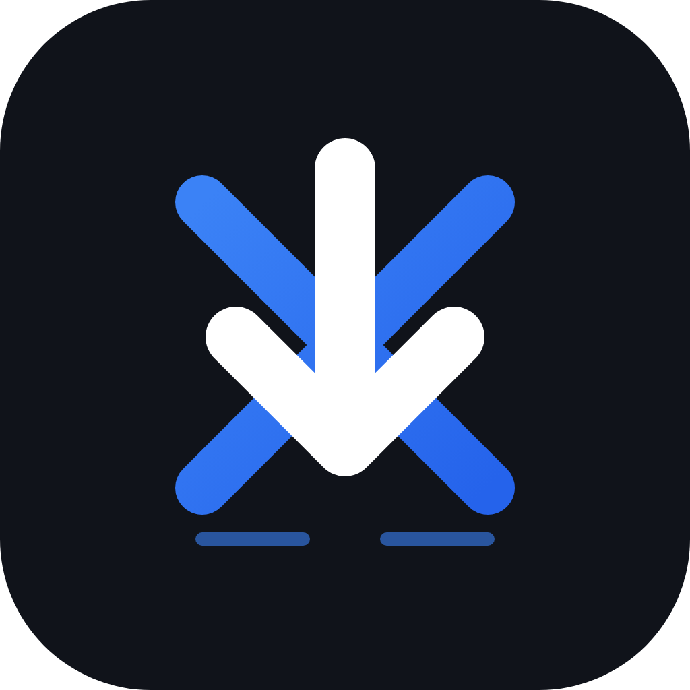

# <p align="center">⚡ XDM // TRANSMISSION CONTROL COCKPIT</p>

<p align="center">
  
</p>

<p align="center">
  <strong>A premium, high-efficiency, multi-threaded parallel download manager application for mobile and desktop environments.</strong>
</p>

<p align="center">
  
  
  
  
</p>

---

## 🎨 Visual Identity & Cyberpunk Aesthetics

XDM features a curated, theme-aware user interface designed as a tactical cyberpunk/neon cockpit. Every file download is treated as a dedicated data stream interception:

*   **Glassmorphism Panels**: Reusable translucent backdrop-blurred cards (`GlassCard`) that adapt seamlessly to light and dark modes. Supports a **Visual Performance Mode** to bypass blurs for low-end device efficiency.
*   **Dynamic Neon Accents**: Cyberpunk neon cyan, violet, green, red, and amber colors designed for low-latency visual alerts.
*   **Geometric Mesh Backgrounds**: Programmatic grid mesh lines with theme-dependent gradient blobs that scale and reposition dynamically.
*   **Tactile Vibrations**: Physical micro-haptic pulses (`HapticHelper`) mapped to transitions, downloads, and interface clicks.

---

## 🚀 Key Features & Architectural Enhancements

### 1. Multi-Threaded Range Pipeline
*   **Parallel Chunk Execution**: Splits files dynamically into multiple connection channels (threads) using chunked byte ranges, streaming into temporary `.part$index` segment files, and merging them sequentially upon completion.
*   **Single-Thread Fallback**: Gracefully recovers and switches to single-threaded download streams when servers do not support range headers or expose `Content-Length`.
*   **Rolling-Window Speed Estimation**: Tracks download speeds using a smooth 3-second rolling-window interval to prevent erratic spikes and stabilize speed indicators.
*   **Proxy Mode & SSL Bypass**: Fully configurable proxy configuration with a setting to bypass SSL verification for debugging or local intercept, protected by user warning notices.
*   **Monotonic Clocks**: Monotonic system stopwatches (`Stopwatch`) prevent time-warp errors during local timezone changes.
*   **Collision-Safe Task IDs**: Cryptographically robust task IDs combining microsecond timestamp tokens with randomized offset tags.
*   **Flexible Connection Channel Controls**: Configurable default thread counts and individual task thread adjustments (`1, 2, 4, 5, 8, 16`) backed by progress safety guards.

### 2. Intelligent Categorization
*   **Automatic Dock Indexing**: Automatically filters and classifies incoming transmissions into Video, Audio, Document, Archive, APK, and General categories.
*   **Interactive Dashboards**: Tapping category badges instantly switches to the Transmissions hub and filters active files, equipped with clearable filter chips.
*   **Categorized Folder Docks**: Automatically arranges saved files into subdirectories matching their classified categories.

### 3. Integrated Web Sandbox Browser
*   **Direct Web Sniffer**: Inline web browser allowing instant downloading.
*   **Broad Download Interception**: Detects and captures redirects, data URIs, base64 data streams, blob URLs, custom user-agent requests, and matches complex queries.
*   **Multi-Tab Support**: Keep multiple tabs alive concurrently in memory (using `IndexedStack`) with separate web views, support for a visual tab-grid switcher, and specialized private Incognito tabs.
*   **Edge Swipe Navigation Gestures**: Drag from screen boundaries (left edge to go back, right edge to go forward) for a fluid, gesture-driven browsing experience.
*   **Offline Page Cache**: Instantly save page DOM structures as offline `.html` documents inside the downloads dock with local file access.
*   **JS Injection / Custom CSS Editor**: Persistent tabbed script editor that injects custom CSS styling and Javascript code automatically when pages load.
*   **Video Quality Selector**: A bottom sheet modal displaying detected resolutions/qualities of video element streams, allowing users to choose their download quality.
*   **Smart Surf & Download History**: Segmented, searchable log page containing both surfing history entries and download history tasks.

### 4. Native App Protections & Services
*   **Biometric Gate Lock**: Secure Local Authentication (`local_auth`) checking on initial app load and background-to-foreground transitions (`paused` ➔ `resumed`) using a lock screen overlay.
*   **Heartbeat Service Monitored Backgrounds**: A 15-second background monitor heartbeat checks task progress telemetries when minimized.
*   **System Notification Quick Actions**: Android notification drawers feature quick **Pause** and **Cancel** buttons, which map actions directly back to the main UI isolate via named `ReceivePorts`.
*   **System Backups**: Export and import transmission signals cleanly to/from JSON archives.

---

## 🛠️ Technology Stack

*   **Framework**: [Flutter](https://flutter.dev/) (Dart SDK `^3.12.0`)
*   **State Management**: [Provider](https://pub.dev/packages/provider)
*   **Local Database**: [Hive](https://pub.dev/packages/hive) & [Hive Flutter](https://pub.dev/packages/hive_flutter)
*   **Networking Engine**: [Dio](https://pub.dev/packages/dio)
*   **Local Auth**: [LocalAuthentication](https://pub.dev/packages/local_auth)
*   **Telemetry Notifications**: [Flutter Local Notifications](https://pub.dev/packages/flutter_local_notifications)
*   **Background Runner**: [Flutter Background Service](https://pub.dev/packages/flutter_background_service)

---

## 📂 Project Structure

```
lib/
├── core/
│   ├── services/       # Database, Download Engine, Permissions, Notifications
│   └── utils/          # Haptics, Localization, File Openers, ID Builders
├── features/
│   ├── add_download/   # Establish new download screens and configurations
│   ├── browser/        # Embedded sniffer webview components
│   ├── categories/     # Classification and storage dashboard
│   ├── details/        # Telemetry logs, speed graphs, thread modifiers
│   ├── downloads/      # Main active list and state provider
│   ├── history/        # Completed transaction logs
│   ├── onboarding/     # Splash authentication and tutorial flows
│   └── settings/       # Global cockpit configuration adjustments
└── shared/
    └── widgets/        # Glassmorphic panels, neon buttons, grid meshes
```

---

## 🚀 Getting Started

### Prerequisites

*   Flutter SDK (version `>= 3.12.0`)
*   Android SDK (min API 24), iOS (iOS 12.0+), or Windows 10+ SDK

### Installation

1.  Clone the repository:
    ```bash
    git clone https://github.com/yourusername/xdm.git
    cd xdm
    ```

2.  Fetch pub dependencies:
    ```bash
    flutter pub get
    ```

3.  Run the development cockpit:
    ```bash
    flutter run
    ```

### Running Tests

To verify package systems and range chunk builders, execute the unit test suite:
```bash
flutter test test/download_provider_test.dart test/download_task_test.dart test/url_file_utils_test.dart
```

---

## ⚙️ Advanced Configuration (Native Platforms)

### Android Permissions
The application requires the following permissions declared in `AndroidManifest.xml`:
*   `android.permission.INTERNET`
*   `android.permission.FOREGROUND_SERVICE`
*   `android.permission.FOREGROUND_SERVICE_DATA_SYNC`
*   `android.permission.ACCESS_NETWORK_STATE`
*   `android.permission.RECEIVE_BOOT_COMPLETED`
*   `android.permission.POST_NOTIFICATIONS`

### iOS Configuration
*   Background processing tasks and local networking access are registered under the iOS background scheduler task registry (`Info.plist`).

---

## 📄 License

This project is licensed under the MIT License - see the [LICENSE](LICENSE) file for details.